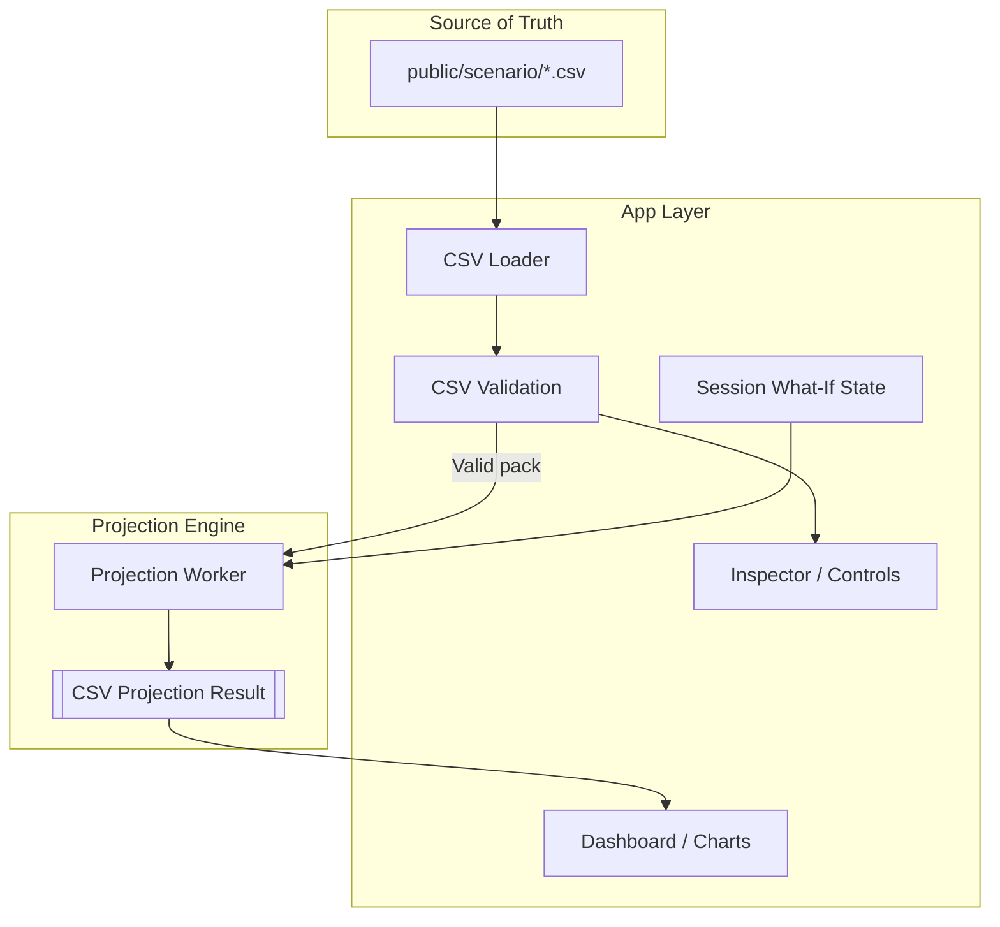
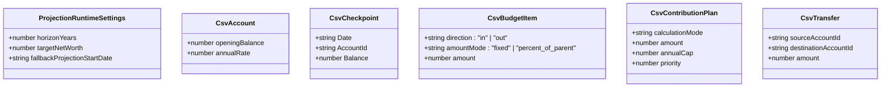
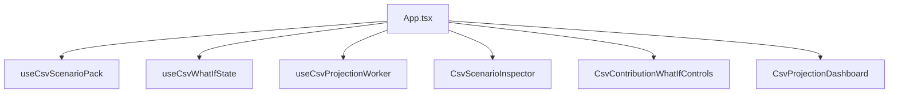

# Technical Overview: Net Worth Estimator

The Net Worth Estimator is a single-page React application that projects net worth from a simplified CSV-backed data model plus runtime projection settings.

## 1. Tech Stack

*   **Core/Framework:** React 19, Vite, TypeScript
*   **Styling:** Tailwind CSS v4
*   **Visualization:** Recharts
*   **Testing:** Vitest
*   **CSV Parsing:** Papa Parse
*   **Validation:** Zod

## 2. High-Level Architecture & Data Flow

The application loads canonical CSV files from the repo, validates them, projects balances in a worker using exact dated events, and renders a read-only inspector plus dashboard. Temporary what-if overrides and target-net-worth changes exist only in browser memory for the current session.

### Data Flow Execution:
1.  **Load:** `useCsvScenarioPack.ts` fetches the CSV files from `public/scenario/`.
2.  **Validate:** Zod-based parsing plus reference validation rejects invalid packs before projection.
3.  **Temporary Overrides:** `useCsvWhatIfState.ts` stores session-only contribution overrides such as multipliers.
4.  **Project:** `csvProjectionWorker.ts` runs the projection engine off the main thread.
5.  **Render:** The inspector and dashboard render the validated pack and projected results.

## 3. Core Concepts & Domain Hierarchy

The product now uses five CSV-backed concepts plus runtime projection settings.

### Key Domain Entities:

*   **Accounts:** Tracked signed balances that contribute directly to net worth.
*   **Checkpoints:** Historical truth for account balances.
*   **Budget Items:** Dated income and spending assumptions used only to compute contribution capacity.
*   **Contribution Plans:** Dated future balance-changing contributions into tracked accounts.
*   **Transfers:** Optional dated account-to-account moves.
*   **Runtime Projection Settings:** In-memory target net worth, fallback start date, and fixed 50-year horizon.

## 4. UI Structure and Components

The React interface is now a read-only inspector plus temporary what-if controls.

*   **`App.tsx`:** Orchestrates pack loading, validation, overrides, and worker-based projection.
*   **`CsvScenarioInspector.tsx`:** Shows read-only CSV-backed data tables plus validation issues.
*   **`CsvContributionWhatIfControls.tsx`:** Lets the user apply temporary multiplier overrides to contribution plans.
*   **`CsvProjectionDashboard.tsx`:** Renders current and projected net worth, signed account balances, dated event rows, and contribution utilization.

## 5. Technical Highlights
*   **Repo-Backed Source of Truth:** The canonical financial data is plain CSV in the repo, so edits can happen without launching the app.
*   **Read-Only Persistent UI:** The app does not write scenario data back into browser storage.
*   **Worker-Based Projection:** The projection engine runs off the main thread.
*   **Signed Balance Model:** Debt is represented with negative balances, so net worth is the sum of enabled accounts without liability-specific math.
*   **Dated Event Engine:** Future projections run on exact checkpoint and scheduled event dates with daily compounding between dates.
*   **Strict Separation of Capacity vs. Balances:** `budget_items` affect contribution capacity, while `contribution_plans`, `transfers`, and `annualRate` values affect balances.
