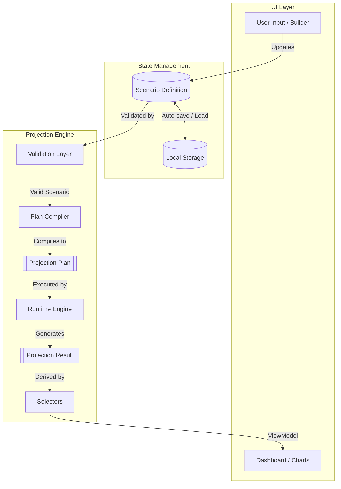
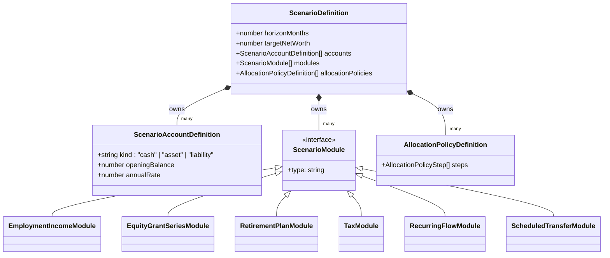
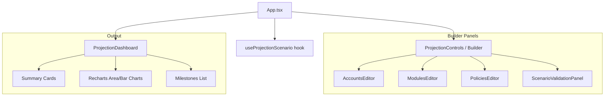

# Technical Overview: Net Worth Estimator

The Net Worth Estimator is a single-page React application that acts as a financial scenario modeling engine. It projects net worth growth over time by simulating complex personal finance entities like salaries, RSUs, 401(k) matches, taxes, debt payoffs, and investments.

## 1. Tech Stack

*   **Core/Framework:** React 19, Vite, TypeScript
*   **Styling:** Tailwind CSS v4
*   **Visualization:** Recharts
*   **Testing:** Vitest
*   **State Persistence:** LocalStorage API (persists versioned JSON documents)

## 2. High-Level Architecture & Data Flow

The application enforces a strict separation between the React UI layer and the pure TypeScript projection engine. Data flows unidirectionally from the user's input, through a validation phase, into the compiler, and finally through the runtime simulator to produce data for the dashboard.

### Data Flow Execution:
1.  **State Updates:** React (`useProjectionScenario.ts`) maintains the current `ScenarioDefinition`.
2.  **Deferral & Validation:** User input is deferred (`useDeferredValue`) so heavy projection logic doesn't block the UI thread. The scenario is checked for duplicate modules or invalid references.
3.  **Compilation:** If valid, the `ScenarioDefinition` is sent to the `planCompiler`, which strips away high-level domain concepts (like "RSU Grants") and flattens them into a `ProjectionPlan` made of generic `RuntimeOperation` instructions.
4.  **Simulation:** The `runtime` executes these generic instructions month-by-month over the timeline (horizon).
5.  **Rendering:** `selectors` aggregate the complex timeline output (`ProjectionResult`) into a clean `DashboardViewModel`, which `Recharts` consumes to draw graphs.

## 3. Core Concepts & Domain Hierarchy

The project's domain models are heavily typed and structured compositionally. A Scenario is the root document that holds all financial entities.

### Key Domain Entities:

*   **`ScenarioDefinition`:** The single source of truth. It is a serializable JSON document containing all user configurations.
*   **Accounts (`ScenarioAccountDefinition`):** The buckets holding money. They are categorized as `cash`, `asset`, or `liability`.
*   **Modules (`ScenarioModule`):** The financial actors. Rather than hard-coding business logic into a single monolithic loop, financial behaviors are split into modular plugins:
    *   *Employment:* Handles base salary, bonuses, and raises over time.
    *   *Equity Grants:* Schedules stock vesting events.
    *   *Retirement:* Handles 401(k) contributions and employer matching.
    *   *Taxes:* Computes ordinary income vs. capital gains taxes dynamically.
*   **Allocation Policies:** Defines the waterfall of how leftover cash at the end of a simulated month is distributed (e.g., pay off student loan first, then put the rest into a taxable fund).

## 4. UI Structure and Components

The React interface is composed of modular builder panels and a presentation-agnostic dashboard.

*   **`App.tsx`:** Orchestrates state, deferred rendering, and invokes the projection engine.
*   **`ProjectionControls.tsx`:** A wrapper that houses all forms to edit the `ScenarioDefinition`.
*   **`ProjectionDashboard.tsx`:** Receives the fully computed `ProjectionResult` and standardizes it through a selector to feed chart components.

## 5. Technical Highlights
*   **Event-Sourced Runtime:** The simulation is essentially an event loop. Complex things like tax calculations or vesting schedules don't mutate state directly; instead, they emit generic `ProjectionEvent` objects which apply `RuntimeEffect` deltas to accounts.
*   **Deferred Projection:** By utilizing React 18's `useDeferredValue`, the app ensures typing in the configuration textboxes remains perfectly smooth at 60fps, even if projecting a 30-year scenario takes a few milliseconds on the main thread.
*   **Dynamic Referencing:** Modules reference accounts by string ID. The validation layer (`validation.ts`) acts almost like a static type checker, ensuring that an Allocation Policy isn't trying to deposit into a non-existent account before the runtime crashes.
